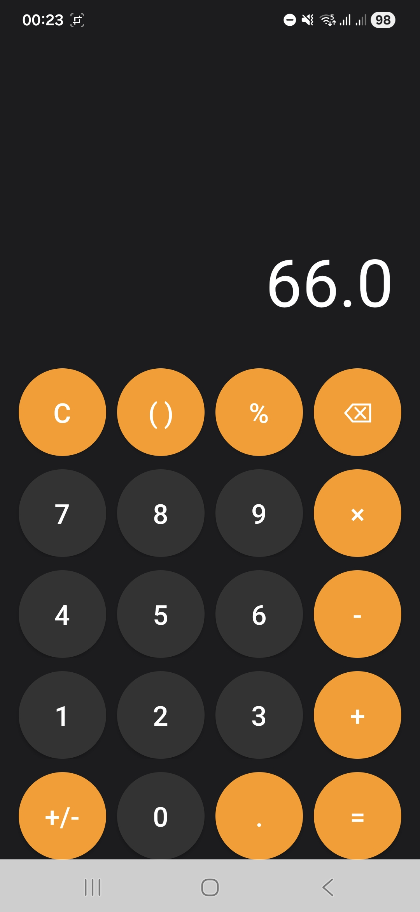
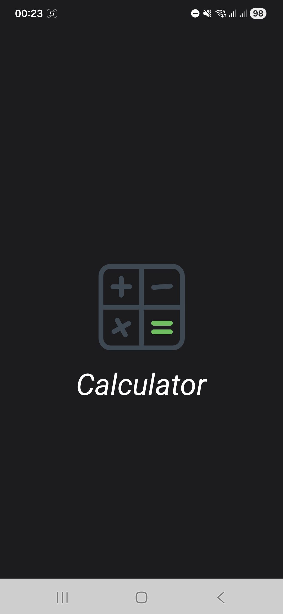

# Basic Calculator – Android App

A simple calculator app built using **Java** and **Android Studio**.

It supports:
- Number input with decimal support
- Addition, subtraction, multiplication, division
- Chained operations (e.g., `1 + 2 + 3 = 6`)
- Clear and delete
- Lottie animation splash screen
- Custom adaptive app icon
- Signed release builds (APK & AAB)

## 📸 Screenshots

## 🔧 Tech Stack
- Java
- Android SDK
- XML layouts
- Lottie Animations
- Git & GitHub

## 📱 Download APK
👉 https://github.com/invinciblejaz/basic-calculator-android/releases/download/v1.0.0/app-release.apk

## 🚀 Future Improvements
- Percentage support
- Advanced scientific functions
- Calculation history
